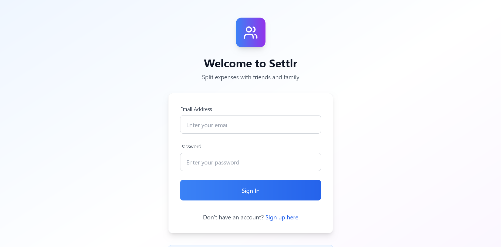
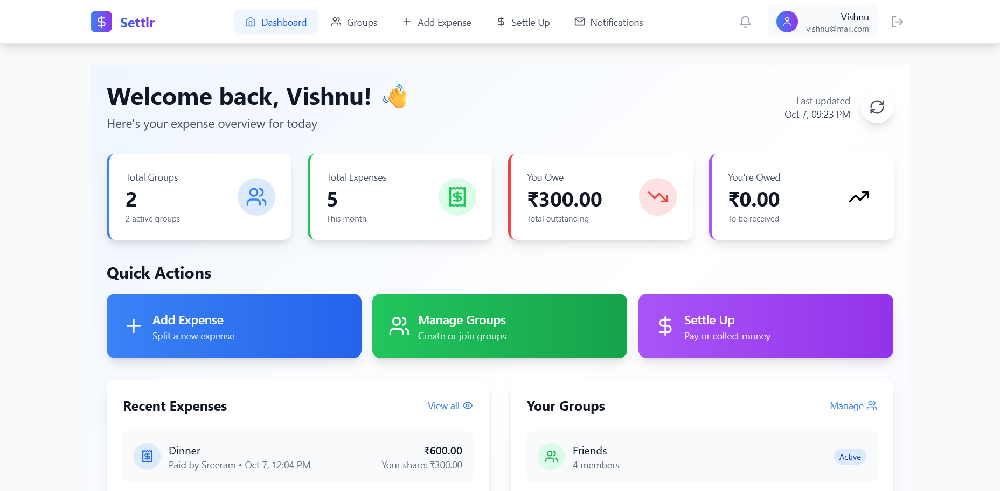
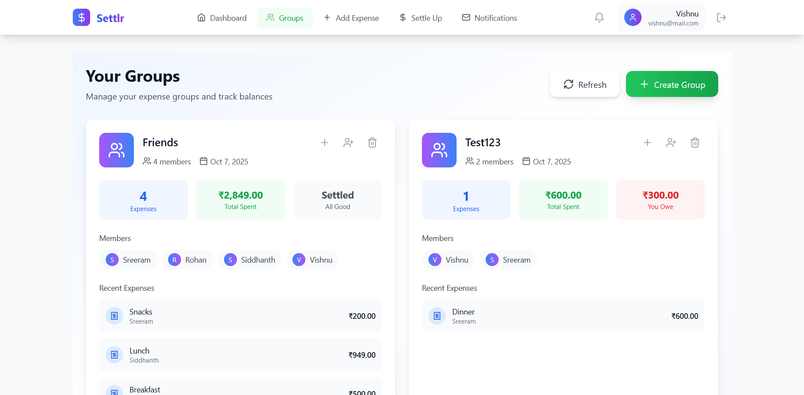
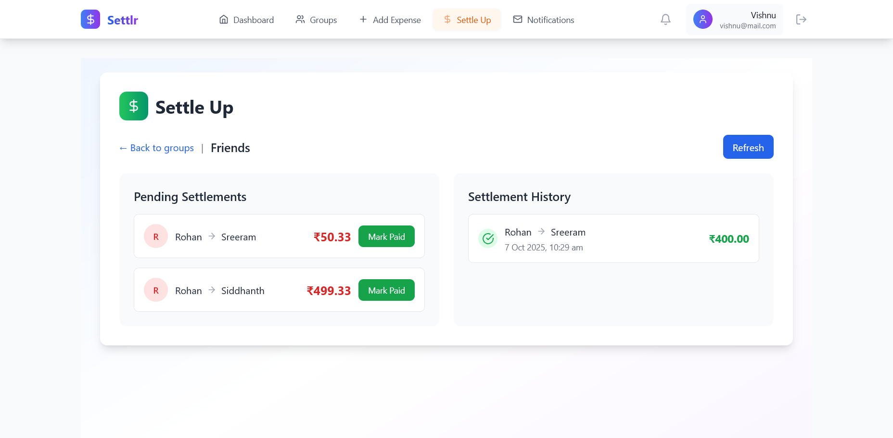

# 💰 Settlr - Split Expenses Made Simple

<div align="center">


A modern, full-stack expense splitting application built with **Spring Boot** and **React**. Split bills, track group expenses, and settle debts with friends and family effortlessly.

[](https://www.oracle.com/java/)
[](https://spring.io/projects/spring-boot)
[](https://reactjs.org/)
[](https://www.postgresql.org/)

</div>

## 📱 Application Screenshots

<div align="center">

### 🔐 Login Page

*Clean and intuitive login interface with secure authentication*

### 🏠 Dashboard

*Comprehensive overview of expenses, groups, and quick actions*

### 👥 Groups Management

*Manage expense groups and track member balances*

### 💸 Settlement System

*Smart settlement tracking with payment history*

</div>

## ✨ Features

- 🎯 **Smart Expense Splitting** - Automatically calculate who owes what
- 👥 **Group Management** - Create and manage expense groups with multiple members
- 📱 **Mobile-First Design** - Responsive PWA with offline support
- 🔐 **Secure Authentication** - JWT-based user registration and login system
- 💸 **Settlement Tracking** - Track payments and settle debts efficiently
- 🔔 **Real-Time Updates** - Live notifications for group activities
- 📊 **Expense Analytics** - View spending patterns and detailed balances
- 🌙 **Modern UI/UX** - Clean, intuitive interface with Tailwind CSS
- ⚡ **High Performance** - Optimized backend with Spring Boot and JPA

## 🚀 Quick Start

### Prerequisites

- **Java 21** or higher
- **Node.js 18** or higher
- **PostgreSQL** database
- **Maven 3.6+**

### 1. Clone the Repository

```bash
git clone https://github.com/LORDv1shnu/settlr.git
cd settlr
```

### 2. Database Setup

```sql
-- Create database
CREATE DATABASE settlr_db;

-- Create user (optional)
CREATE USER settlr_user WITH PASSWORD 'your_password';
GRANT ALL PRIVILEGES ON DATABASE settlr_db TO settlr_user;
```

### 3. Backend Configuration

Navigate to the backend directory and update `application.properties`:

```properties
# Database Configuration
spring.datasource.url=jdbc:postgresql://localhost:5432/settlr_db
spring.datasource.username=settlr_user
spring.datasource.password=your_password

# JPA Configuration
spring.jpa.hibernate.ddl-auto=update
spring.jpa.show-sql=true
spring.jpa.properties.hibernate.dialect=org.hibernate.dialect.PostgreSQLDialect

# Server Configuration
server.port=8080
```

### 4. Run the Backend

```bash
cd backend
./mvnw spring-boot:run
```

The backend will start on `http://localhost:8080`

### 5. Frontend Setup

```bash
cd frontend
npm install
npm start
```

The frontend will start on `http://localhost:3000`

## 🏗️ Architecture

### Backend (Spring Boot)
- **Controllers**: RESTful API endpoints
- **Services**: Business logic layer
- **Repositories**: Data access layer with Spring Data JPA
- **Entities**: Database models with proper relationships
- **DTOs**: Data transfer objects for API communication
- **Security**: JWT authentication and CORS configuration

### Frontend (React)
- **Components**: Reusable UI components
- **Context**: State management with React Context
- **Routing**: Client-side routing with React Router
- **Styling**: Tailwind CSS for responsive design
- **PWA**: Service worker for offline functionality

### Database Schema
- **Users**: User authentication and profile data
- **Groups**: Expense groups with member management
- **Expenses**: Individual expense records
- **Settlements**: Payment tracking and history

## 🔧 API Endpoints

### Authentication
- `POST /api/auth/register` - User registration
- `POST /api/auth/login` - User login
- `GET /api/auth/profile` - Get user profile

### Groups
- `GET /api/groups` - Get user's groups
- `POST /api/groups` - Create new group
- `PUT /api/groups/{id}` - Update group
- `DELETE /api/groups/{id}` - Delete group

### Expenses
- `GET /api/expenses` - Get expenses
- `POST /api/expenses` - Add new expense
- `PUT /api/expenses/{id}` - Update expense
- `DELETE /api/expenses/{id}` - Delete expense

### Settlements
- `GET /api/settlements/{groupId}` - Get group settlements
- `POST /api/settlements` - Record payment
- `GET /api/settlements/history` - Get settlement history

## 🛠️ Development

### Running Tests

Backend tests:
```bash
cd backend
./mvnw test
```

Frontend tests:
```bash
cd frontend
npm test
```

### Building for Production

Backend:
```bash
cd backend
./mvnw clean package
```

Frontend:
```bash
cd frontend
npm run build
```

## 📦 Deployment

### Docker Support (Optional)

Create a `Dockerfile` for containerized deployment:

```dockerfile
# Backend Dockerfile
FROM openjdk:21-jdk-slim
COPY target/settlr-backend.jar app.jar
EXPOSE 8080
ENTRYPOINT ["java", "-jar", "/app.jar"]
```

### Environment Variables

Set the following environment variables for production:

```bash
SPRING_DATASOURCE_URL=your_production_db_url
SPRING_DATASOURCE_USERNAME=your_db_username
SPRING_DATASOURCE_PASSWORD=your_db_password
JWT_SECRET=your_jwt_secret_key
```

## 🤝 Contributing

1. Fork the repository
2. Create a feature branch (`git checkout -b feature/amazing-feature`)
3. Commit your changes (`git commit -m 'Add amazing feature'`)
4. Push to the branch (`git push origin feature/amazing-feature`)
5. Open a Pull Request

## 📝 License

This project is licensed under the MIT License - see the [LICENSE](LICENSE) file for details.

## 👨‍💻 Author

**Vishnu** - [GitHub Profile](https://github.com/LORDv1shnu)

## 🙏 Acknowledgments

- Spring Boot community for excellent documentation
- React team for the powerful frontend framework
- Tailwind CSS for the utility-first CSS framework
- PostgreSQL for reliable database management

---

<div align="center">
Made with ❤️ by Vishnu
</div>
